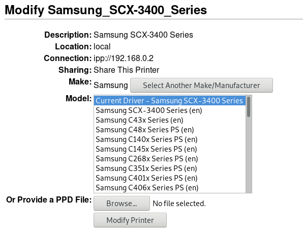

# About all

This is my utils scripts and config files

# Printer

## Arch

Install the [CUPS](https://wiki.archlinux.org/index.php/CUPS#Configuration) to manager sources printers and [Avahi](https://wiki.archlinux.org/index.php/Avahi) to find networks printers.

Start both services.

***Samsung***

Install the driver from site or install the [Samsung undefied
driver](https://wiki.archlinux.org/index.php/CUPS/Printer-specific_problems#Samsung) from [AUR](https://aur.archlinux.org/packages/samsung-unified-driver/).

Then go in CUPS administration http://localhost:631/ click in add printers. Do
the loggin as as ***root*** or a user with permission to manage printers. Add
the printer and use default options.

# OS configuration

This section is to link with others instructions for OS customization

## Wallpaper background

Install the [Feh](https://wiki.archlinux.org/index.php/feh) and create the
script of wallpaper. Then set it in profile initialization.

[Wallpaper](i3/wallpaper.sh)

## Base alias

This is the base alias commands.

[Aliases](.bash_alias)

## Bash utils

The script [bash utils](.bash_utils) has some utils functions to bash:

* se and searchenvdir: search for a virtual env from / to current dir
* extract: base function to extract data from some compressed files
* _git: show current branch to print in PS1
* _env: show .pyenv name to print in PS1
* calc: command line calculator using python or awk. To use '()' is necessary quotations ""

# I3

The [i3 folder](i3) contains configuration file to i3 window manager. To use it, copy the entire folder to `$HOME/.config/`.

# Utils packages

## Pacman

* bash-completion
* qbittorrent

## Yaourt

* polybar

## Pip

* [grip](https://github.com/joeyespo/grip)
